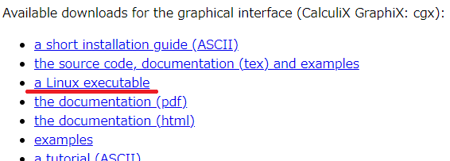

CalculiX
========

CalculiXは有限要素法を使用したオープンソースの解析コードです。CalculiXは有限要素モデルの構築、計算、ポスト処理ができます。CalculiXはGUIであるcgxとソルバであるccxが提供されています。

CalculiXについては次のサイトで公開されています。

http://www.calculix.de/

インストール
=============

最新版を使用する場合はコンパイルが必要になります。
本節ではバイナリ版を導入する場合の手順を説明します。

Ubuntu（LinuxもしくはWSL）
----------------------------

バイナリ版は `公式ページ <http://www.dhondt.de/>`_ の"a Linux executable"からダウンロードできます。
2023年6月18日時点ではバイナリ版はUbnutu-22.04にgfortran-7がインストールできないため、実行時にエラーで動作しません。
Ubnutuを使う人はUbuntu-20.04以前を使用してください。

ダウンロードしたtar.bz2ファイルは次のコマンドで解凍できます。

.. code-block::

    sudo cp ccx_2.20.tar.bz2 /usr/local
    cd /usr/local
    sudo tar jxvf ./ccx_2.20.tar.bz2
    sudo cp ./CalculiX/ccx_2.20/src/ccx_2.20 ../bin

計算実行
========

計算を実行する場合は次のコマンドで実行します。<jobname>のところは実行する計算インプットのファイル名を入力します。拡張子は除きます。

.. code-block::

    ccx_2.20 -i <jobname>

libgfortran.so.4に関するエラーが表示された場合は、gfortran-7をインストールします。

.. code-block:: 

    sudo apt update
    sudo apt install gfortran-7