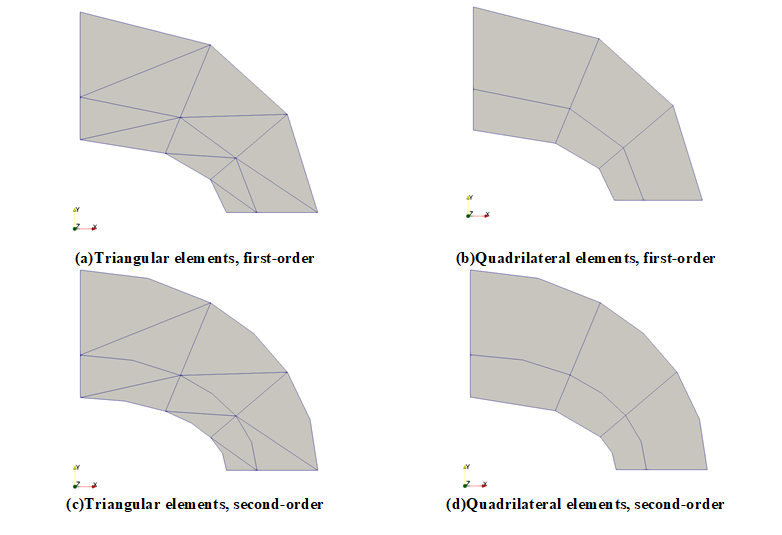
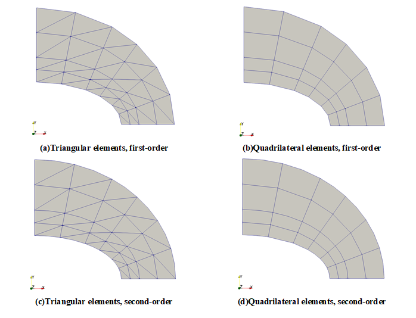
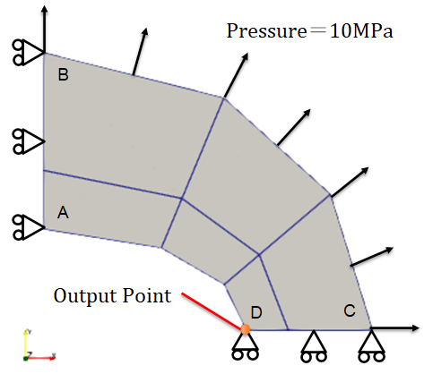
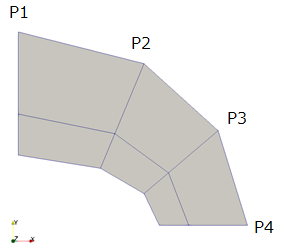
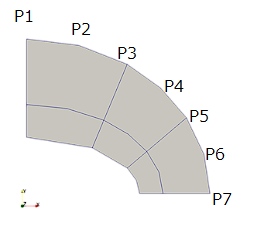
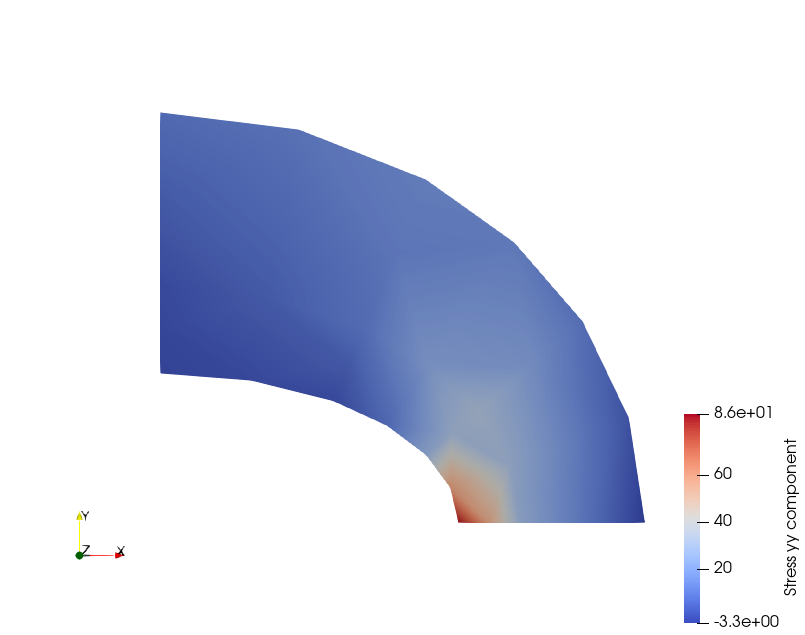

Elliptic Membrane
=================

問題の説明
----------

圧力を負荷された楕円形状に発生する応力を確認するベンチマークです。The Standard NAFEMS BenchmarksにLE1として掲載されています。

条件
----

ベンチマークに使用するメッシュパターンはCoarse modelとFine modelの2種類としました。

使用した要素は1次要素、2次要素およびそれらの低減要素です。

Coarse modelのメッシュは次の通りです。

Fine modelのメッシュは次の通りです。

条件図を次に示します。DCはY軸並進成分を固定、ABはX軸並進成分を固定します。

圧力を分布荷重でなく、節点荷重で入力する場合は次の値を使ってください。

.. table:: Coarse modelの1次要素での節点荷重での入力値

   ================ ================ ================
   荷重負荷点          X方向荷重         Y方向荷重
   ================ ================ ================
   P1               0.22541650839261 0.89157542285781 
   P2               0.70102081859851 1.41645978746927 
   P3               1.14962590851575 0.73350821250962 
   P4               0.67402159830985 0.20862384789816 
   ================ ================ ================

.. table:: Coarse modelの2次要素での節点荷重での入力値

   ================ ================ ================
   荷重負荷点          X方向荷重         Y方向荷重
   ================ ================ ================
   p1               0.07573283517252 0.29954121383850 
   p2               0.30293134069007 1.19816485535401 
   p3               0.23539958078805 0.47575193464905 
   p4               0.63866698246212 0.70484288324220 
   p5               0.38679458389610 0.24651155939748 
   p6               0.90851135312226 0.28120335434771 
   p7               0.22712783828057 0.07030083858693 
   ================ ================ ================

入力する物性値は次の通りです。

.. table:: 入力した材料物性

   ========== ==========
   材料物性   入力値
   ========== ==========
   ヤング率   210000 MPa
   ポアソン比 0.3
   要素種別    平面応力要素
   厚さ       0.1 mm
   ========== ==========

結果と考察
----------

比較する結果はD点のY方向応力です。参照値は92.7MPaです。比較結果を示します。

1次三角形要素Coarse modelの結果は次の通りです。

.. table:: Results using first-order triangular elements (Coarse model)
   :widths: auto

   =============== ====== ====== ===== ===== ====== =======
   Solver          Mesh   Type   Order Shape Result Error
   =============== ====== ====== ===== ===== ====== =======
   Reference value -      -      -     -     92.7   ‐ 
   Commercial code Coarse CPS3   1     tria  52.9   -42.90%
   Calculix 2.18   Coarse CPS3   1     tria  53.3   -42.50%
   Code-Aster 14.4 Coarse C_PLAN 1     tria  52.9   -42.90%
   FrontISTR v5.2  Coarse 231    1     tria  52.9   -42.90%
   =============== ====== ====== ===== ===== ====== =======
   
1次四角形要素Coarse modelの結果は次の通りです。

.. table:: Results using first-order quadrilateral elements (Coarse model)
   :widths: auto

   =============== ====== ====== ===== ===== ====== =======
   Solver          Mesh   Type   Order Shape Result Error   
   =============== ====== ====== ===== ===== ====== =======
   Reference value -      -      -     -     92.7   ‐       
   Commercial code Coarse CPS4   1     quad  70.6   -23.90% 
   Calculix 2.18   Coarse CPS4   1     quad  69.7   -24.80%
   Code-Aster 14.4 Coarse C_PLAN 1     quad  70.6   -23.90% 
   FrontISTR v5.2  Coarse 241    1     quad  70.6   -23.90% 
   =============== ====== ====== ===== ===== ====== =======

2次三角形要素Coarse modelの結果は次の通りです。

.. table:: Results using second-order triangular elements (Coarse model)
   :widths: auto

   =============== ====== ====== ===== ===== ======= ======
   Solver          Mesh   Type   Order Shape Result  Error 
   =============== ====== ====== ===== ===== ======= ======  
   Reference value -      -      -     -     92.7    ‐       
   Commercial code Coarse CPS6   2     tria  89.9    -3.00%  
   Calculix 2.18   Coarse CPS6   2     tria  90.1    -2.80%  
   Code-Aster 14.4 Coarse C_PLAN 2     tria  89.9    -3.00%  
   FrontISTR v5.2  Coarse 232    2     tria  Not run -     
   =============== ====== ====== ===== ===== ======= ======

2次四角形要素Coarse modelの結果は次の通りです。

.. table:: Results using second-order quadrilateral elements (Coarse model)
   :widths: auto

   =============== ====== ====== ===== ===== ====== ======
   Solver          Mesh   Type   Order Shape Result Error 
   =============== ====== ====== ===== ===== ====== ======
   Reference value -      -      -     -     92.7   ‐     
   Commercial code Coarse CPS8   2     quad  85.7   -7.50%
   Calculix 2.18   Coarse CPS8   2     quad  85.2   -8.10%
   Code-Aster 14.4 Coarse C_PLAN 2     quad  87.8   -5.30%
   FrontISTR v5.2  Coarse 242    2     quad  86.8   -6.40%
   =============== ====== ====== ===== ===== ====== ======

1次四角形低減要素Coarse modelの結果は次の通りです。

.. table:: Results using first-order reduced quadrilateral elements (Coarse model)
   :widths: auto

   =============== ====== ========= ========== ===== ====== ========
   Solver          Mesh   Type      Order      Shape Result Error    
   =============== ====== ========= ========== ===== ====== ========
   Reference value -      -         -          -     92.7   ‐        
   Commercial code Coarse CPS4R     1(reduced) quad  48     -48.20%  
   Calculix 2.18   Coarse CPS4R     1(reduced) quad  72.5   -21.80%  
   Code-Aster 14.4 Coarse C_PLAN_SI 1(reduced) quad  -33.1  -135.70%
   =============== ====== ========= ========== ===== ====== ======== 

2次四角形低減要素Coarse modelの結果は次の通りです。

.. table:: Results using second-order reduced quadrilateral elements (Coarse model)
   :widths: auto

   =============== ====== ========= ========== ===== ====== ======
   Solver          Mesh   Type      Order      Shape Result Error  
   =============== ====== ========= ========== ===== ====== ======
   Reference value -      -         -          -     92.7   ‐      
   Commercial code Coarse CPS8R     2(reduced) quad  85.8   -7.50% 
   Calculix 2.18   Coarse CPS8R     2(reduced) quad  85.6   -7.70% 
   Code-Aster 14.4 Coarse C_PLAN_SI 2(reduced) quad  86.2   -7.10%
   =============== ====== ========= ========== ===== ====== ====== 

1次三角形要素Fine modelの結果は次の通りです。

.. table:: Results using first-order triangular elements (Fine model)
   :widths: auto

   =============== ==== ====== ===== ===== ====== =======
   Solver          Mesh Type   Order Shape Result Error   
   =============== ==== ====== ===== ===== ====== =======
   Reference value -    -      -     -     92.7   ‐       
   Commercial code Fine CPS3   1     tria  72.9   -21.30% 
   Calculix 2.18   Fine CPS3   1     tria  73.2   -21.00% 
   Code-Aster 14.4 Fine C_PLAN 1     tria  72.9   -21.30% 
   FrontISTR v5.2  Fine 231    1     tria  73     -21.30%
   =============== ==== ====== ===== ===== ====== =======

1次四角形要素Fine modelの結果は次の通りです。

.. table:: Results using first-order quadrilateral elements (Fine model)
   :widths: auto

   =============== ==== ====== ===== ===== ====== ======
   Solver          Mesh Type   Order Shape Result Error   
   =============== ==== ====== ===== ===== ====== ======
   Reference value -    -      -     -     92.7   ‐       
   Commercial code Fine CPS4   1     quad  85.4   -7.90% 
   Calculix 2.18   Fine CPS4   1     quad  85.6   -7.70%  
   Code-Aster 14.4 Fine C_PLAN 1     quad  85.4   -7.90%  
   FrontISTR v5.2  Fine 241    1     quad  86.9   -6.30%
   =============== ==== ====== ===== ===== ====== ======

2次三角形要素Fine modelの結果は次の通りです。

.. table:: Results using second-order triangular elements (Fine model)
   :widths: auto

   =============== ==== ====== ===== ===== ======= =====
   Solver          Mesh Type   Order Shape Result  Error
   =============== ==== ====== ===== ===== ======= =====
   Reference value -    -      -     -     92.7    ‐       
   Commercial code Fine CPS6   2     tria  93.5    0.90%   
   Calculix 2.18   Fine CPS6   2     tria  93.7    1.10%   
   Code-Aster 14.4 Fine C_PLAN 2     tria  93.5    0.90%   
   FrontISTR v5.2  Fine 232    2     tria  Not Run -    
   =============== ==== ====== ===== ===== ======= =====   

2次四角形要素Fine modelの結果は次の通りです。

.. table:: Results using second-order quadrilateral elements (Fine model)
   :widths: auto

   =============== ==== ====== ===== ===== ====== =======
   Solver          Mesh Type   Order Shape Result Error   
   =============== ==== ====== ===== ===== ====== =======
   Reference value -    -      -     -     92.7   ‐       
   Commercial code Fine CPS8   2     quad  92     -0.70%  
   Calculix 2.18   Fine CPS8   2     quad  93     0.30%   
   Code-Aster 14.4 Fine C_PLAN 2     quad  92.2   -0.50%  
   FrontISTR v5.2  Fine 242    2     quad  77.2   -16.80%
   =============== ==== ====== ===== ===== ====== =======

1次四角形低減要素Fine modelの結果は次の通りです。

.. table:: Results using first-order reduced quadrilateral elements (Fine model)
   :widths: auto

   =============== ==== ========= ========== ===== ====== =======
   Solver          Mesh Type      Order      Shape Result Error  
   =============== ==== ========= ========== ===== ====== =======
   Reference value -    -         -          -     92.7   ‐      
   Commercial code Fine CPS4R     1(reduced) quad  62.6   -32.50%
   Calculix 2.18   Fine CPS4R     1(reduced) quad  61.6   -33.50%
   Code-Aster 14.4 Fine C_PLAN_SI 1(reduced) quad  58.2   -37.20%
   =============== ==== ========= ========== ===== ====== =======

2次四角形低減要素Fine modelの結果は次の通りです。

.. table:: Results using second-order reduced quadrilateral elements (Fine model)
   :widths: auto

   =============== ==== ========= ========== ===== ====== ======
   Solver          Mesh Type      Order      Shape Result Error 
   =============== ==== ========= ========== ===== ====== ======
   Reference value -    -         -          -     92.7   ‐     
   Commercial code Fine CPS8R     2(reduced) quad  92.5   -0.20%
   Calculix 2.18   Fine CPS8R     2(reduced) quad  92.6   -0.10%
   Code-Aster 14.4 Fine C_PLAN_SI 2(reduced) quad  92.5   -0.20%
   =============== ==== ========= ========== ===== ====== ======

最も誤差が少なかったCalculixを使用した2次四角形低減要素のY方向応力コンタを次に示します。

