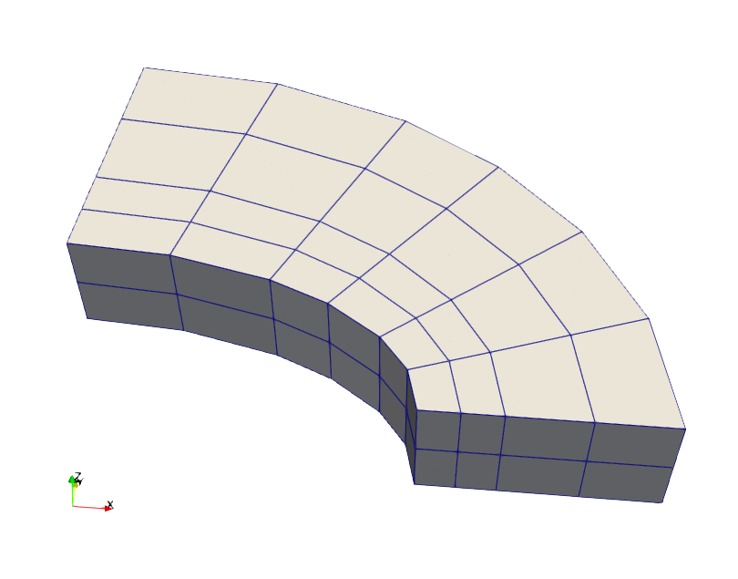
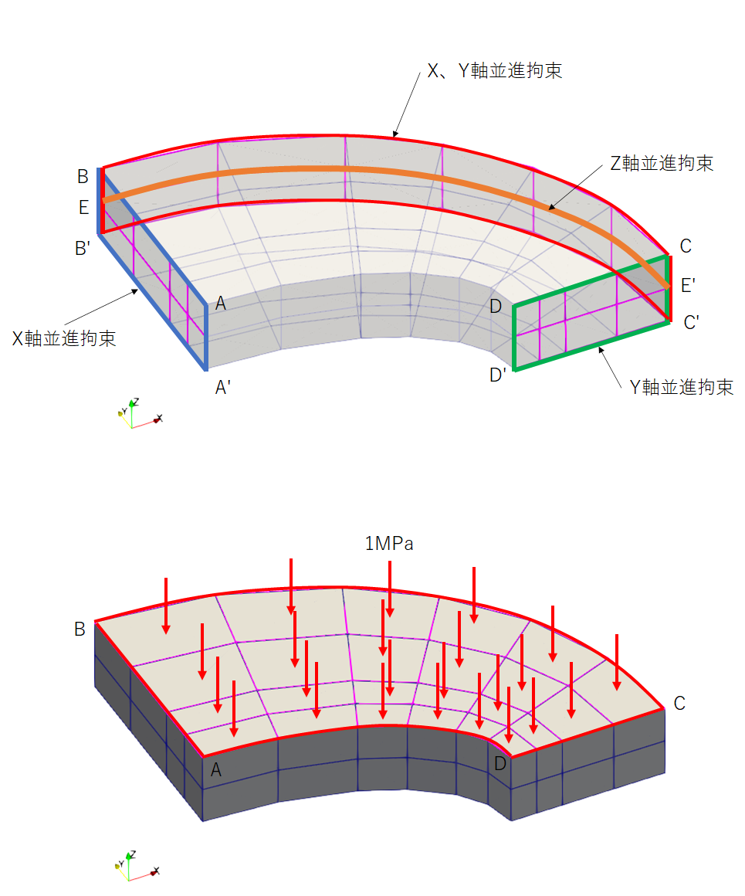
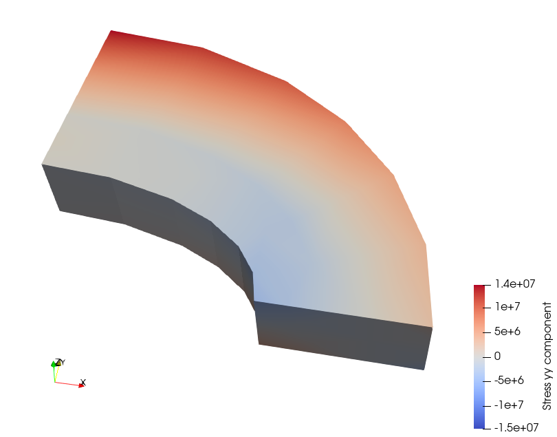

Linear elastic solid
====================

問題の説明
----------

圧力を負荷された楕円形状に発生する応力を確認するベンチマークです。The Standard NAFEMS BenchmarksにLE10として掲載されています。

条件
----

ベンチマークに使用するメッシュパターンはCoarse modelとFine modelの2種類としました。

使用した要素は6面体の1次要素、2次要素です。

Coarse modelのメッシュは次の通りです。

Fine modelのメッシュは次の通りです。

条件図を次に示します。DCD'C'はY軸並進成分を固定、ABA'B'はX軸並進成分を固定します。

BCB'CはX、Y軸並進成分を固定、EE'はZ軸並進成分を固定します。

入力する物性値は次の通りです。

.. table:: 入力した材料物性

   ========== ==========
   材料物性   入力値
   ========== ==========
   ヤング率   2.1E11 Pa
   ポアソン比 0.3
   ========== ==========

結果と考察
----------

比較する結果はD点のY方向応力です。参照値は5.38MPaです。比較結果を示します。

比較結果は次の通りです。

.. table:: Compare results
   :widths: auto

   =============== ====== ====== ========== ===== ====== =======
   Solver          Mesh   Type   Order      Shape Result Error
   =============== ====== ====== ========== ===== ====== =======
   Reference value -      -      -          -     -5.38  0.00%
   Commercial code Coarse C3D8   1          Hex   -2.56  -52.35%
   Commercial code Coarse C3D8I  1          Hex   -5.48  1.92%
   Commercial code Coarse C3D20  2          Hex   -5.29  -1.61%
   Commercial code Coarse C3D20R 2(Reduced) Hex   -5.38  0.01%
   Commercial code Fine   C3D8   1          Hex   -3.83  -28.82%
   Commercial code Fine   C3D8I  1          Hex   -5.50  2.18%
   Commercial code Fine   C3D20  2          Hex   -5.61  4.19%
   Commercial code Fine   C3D20R 2(Reduced) Hex   -5.61  4.19%
   Calculix 2.18   Coarse C3D8   1          Hex   -3.99  -25.84%
   Calculix 2.18   Coarse C3D8I  1          Hex   -7.25  34.70%
   Calculix 2.18   Coarse C3D20  2          Hex   -5.31  -1.27%
   Calculix 2.18   Coarse C3D20R 2(Reduced) Hex   -5.38  -0.02%
   Calculix 2.18   Fine   C3D8   1          Hex   -5.11  -5.07%
   Calculix 2.18   Fine   C3D8I  1          Hex   -6.25  16.22%
   Calculix 2.18   Fine   C3D20  2          Hex   -5.66  5.24%
   Calculix 2.18   Fine   C3D20R 2(Reduced) Hex   -4.06  -24.47%
   FrontISTR v5.2  Coarse 361    1          Hex   -6.31  17.27%
   FrontISTR v5.2  Coarse 362    1          Hex   -5.50  2.31%
   FrontISTR v5.2  Fine   361    1          Hex   -5.45  1.26%
   FrontISTR v5.2  Fine   362    1          Hex   -5.70  6.03%
   =============== ====== ====== ========== ===== ====== =======

最も誤差が少なかったCalculixを使用した2次6面体低減要素のY方向応力コンタを次に示します。

