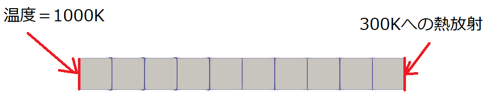
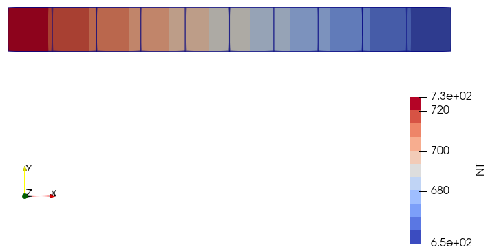

One dimensional heat transfer with radiation
============================================

問題の説明
----------

1次元方向の熱伝導解析で発生する温度を確認するベンチマークです。The Standard NAFEMS BenchmarksにT2として掲載されています。

条件
----

ベンチマークに使用するメッシュは次の通りです。

条件図を次に示します。
A端 :math:`d\Omega_A` は :math:`T_A =` 1000K、B端 :math:`d\Omega_A` は :math:`T_B =` 300K常温への放射を定義します。
上端C :math:`d\Omega_C` と下端D :math:`d\Omega_D` は断熱とします。

入力する物性値は次の通りです。

.. table:: 材料物性・その他特性

   ======================================= ===================
   材料物性                                入力値
   ======================================= ===================
   熱伝導率  :math:`\kappa`                55.6 W/m℃
   比熱 :math:`c`                          460.0 J/kg℃
   密度 :math:`\rho`                       7850 kg/m^3
   B端の放射率  :math:`\varepsilon`        0.98
   ステファンボルツマン係数 :math:`\sigma` 5.67E-8 Wm^2・K^-4
   ======================================= ===================

定式化
------

温度 :math:`\theta` の熱方程式と境界条件は次のように書くことができます。

.. math::
   \left\{\begin{array}{l}
   \kappa \left(\dfrac{\partial }{\partial x}\left(\dfrac{\partial \theta }{\partial x}\right)+\dfrac{\partial }{\ \partial y}\left(\dfrac{\partial \theta }{\partial y}\right)+\dfrac{\partial }{\partial z}\left(\dfrac{\partial \theta }{\partial z}\right)\right)=\rho c\dfrac{\partial \theta }{\partial t}  ~~ \mbox{ in } \Omega,\\
   \theta = T_A  ~~ \mbox{ on } d\Omega_A,\\
   -\kappa \dfrac{\partial \theta}{\partial y}=q_B  ~~ \mbox{ on } d\Omega_B,\\
   \kappa \dfrac{\partial \theta}{\partial z}=0  ~~ \mbox{ on } d\Omega_C,\\
   -\kappa \dfrac{\partial \theta}{\partial z}=0  ~~ \mbox{ on } d\Omega_D
   \end{array} \right.

熱流速 :math:`q_B` は次のように考えます。

.. math::
    q_B=\varepsilon \sigma F\left(\theta ^4-T_B^4\right)=\varepsilon \sigma F\left(\theta -T_B\right)\left(\theta +T_B\right)\left(\theta ^2+T_B^2\right)

形状係数 :math:`F` は1とします。
また、線形として扱うため、1時間ステップ前の温度 :math:`\theta_{previous}` を使用して次のように定義します。

.. math::
    q_B=\varepsilon \sigma F\left(\theta -T_B\right)\left(\theta_{previous} +T_B\right)\left(\theta_{previous} ^2+T_B^2\right)

結果と考察
----------

比較する結果はB端の温度です。参照値は927Kです。比較結果を示します。

.. table:: Results
   :widths: auto

   ================ ====== ====== ====== ======== =======
   Solver           Type   Order  Shape  Result   Error
   ================ ====== ====== ====== ======== =======
   Reference value  -      -      -      927      ‐ 
   Commercial code  DC2D4  1      quad   927.009  0.00%
   Commercial code  DC1D2  1      link   927.009  0.00%
   Calculix 2.18    CPS4   1      quad   927.008  0.00%
   Calculix 2.18    B31    1      bar    927.008  0.00%
   ================ ====== ====== ====== ======== =======

Calculix 2.18のCPS4を使用した場合の温度分布のコンタを参考として次に示します。(このコンタで表示されている数字の単位は℃です)

