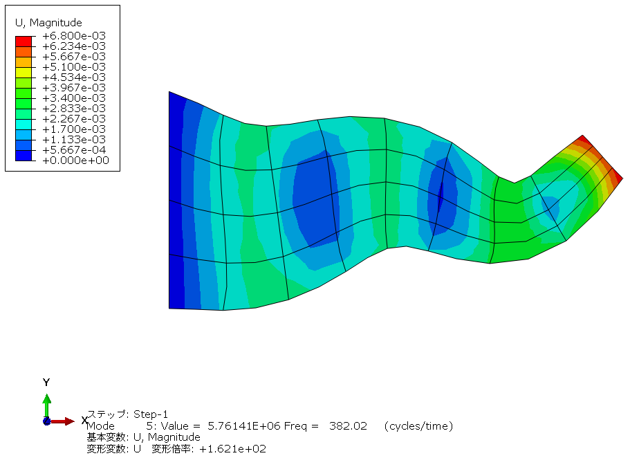

Cantilevered tapered membrane
=============================

問題の説明
----------

テーパのある片持ち梁を膜要素を用いて固有値解析を実施した際の6次モードまでの固有振動数を比較するベンチマークです。The Standard NAFEMS BenchmarksにFV32として掲載されています。

条件
----

ベンチマークに使用するメッシュは次の通りです。1次要素と2次要素でメッシュのパターンを分けています。

.. figure:: cantilevered_tapered_membrane_mesh_HOE.png

条件図を次に示します。図の左端を並進拘束（XY拘束）し、全節点は奥行方向の並進拘束（Z拘束)しています。

入力する物性値は次の通りです。

.. table:: 入力した材料物性・その他特性

   ========== =============
   材料物性   入力値
   ========== =============
   ヤング率   200E+9 N/m^2
   ポアソン比 0.3
   密度       8000 kg/m^3
   ========== =============

結果と考察
----------

比較する結果は各モード次数での固有振動数の値です。B端の温度です。参照値は927Kです。比較結果を示します。

.. table:: Results (Mode1)
   :widths: auto

   ================ ====== ====== ====== ======= ========
   Solver           Type   Order  Shape  Result  Error
   ================ ====== ====== ====== ======= ========
   Reference value  -      1      -      44.905  ‐ 
   Reference value  -      2      -      44.636  ‐ 
   Commercial code  M3D4   1      quad   44.783  99.73%
   Commercial code  M3D8   2      quad   44.636  100.00%
   Calculix 2.18    M3D4   1      quad   44.946  100.09%
   ================ ====== ====== ====== ======= ========

.. figure:: cantilevered_tapered_membrane_commercial_order1_mode1.png

   Commercial code 1st order elements (mode1)

   Commercial code 2nd order elements (mode1)

   Calculix 1nd order elements (mode1)

.. table:: Results (Mode2)
   :widths: auto

   ================ ====== ====== ====== ======= ========
   Solver           Type   Order  Shape  Result  Error
   ================ ====== ====== ====== ======= ========
   Reference value  -      1      -      132.12  ‐ 
   Reference value  -      2      -      130.14  ‐ 
   Commercial code  M3D4   1      quad   130.63  98.87%
   Commercial code  M3D8   2      quad   130.14  100.00%
   Calculix 2.18    M3D4   1      quad   132.23  100.08%
   ================ ====== ====== ====== ======= ========

   Commercial code 1st order elements (mode12)

   Commercial code 2nd order elements (mode2)

   Calculix 1nd order elements (mode2)

.. table:: Results (Mode3)
   :widths: auto

   ================ ====== ====== ====== ======= ========
   Solver           Type   Order  Shape  Result  Error
   ================ ====== ====== ====== ======= ========
   Reference value  -      1      -      162.83  ‐ 
   Reference value  -      2      -      162.72  ‐ 
   Commercial code  M3D4   1      quad   162.59  99.85%
   Commercial code  M3D8   2      quad   162.72  100.00%
   Calculix 2.18    M3D4   1      quad   162.81  99.99%
   ================ ====== ====== ====== ======= ========

   Commercial code 1st order elements (mode3)

.. figure:: cantilevered_tapered_membrane_commercial_order2_mode3.png

   Commercial code 2nd order elements (mode3)

   Calculix 1nd order elements (mode3)

.. table:: Results (Mode4)
   :widths: auto

   ================ ====== ====== ====== ======= ========
   Solver           Type   Order  Shape  Result  Error
   ================ ====== ====== ====== ======= ========
   Reference value  -      1      -      252.99  ‐ 
   Reference value  -      2      -      246.63  ‐ 
   Commercial code  M3D4   1      quad   246.79  97.55%
   Commercial code  M3D8   2      quad   246.63  100.00%
   Calculix 2.18    M3D4   1      quad   253.20  100.08%
   ================ ====== ====== ====== ======= ========

   Commercial code 1st order elements (mode4)

   Commercial code 2nd order elements (mode4)

   Calculix 1nd order elements (mode4)

.. table:: Results (Mode5)
   :widths: auto

   ================ ====== ====== ====== ======= ========
   Solver           Type   Order  Shape  Result  Error
   ================ ====== ====== ====== ======= ========
   Reference value  -      1      -      393.31  ‐ 
   Reference value  -      2      -      382.02  ‐ 
   Commercial code  M3D4   1      quad   379.14  96.40%
   Commercial code  M3D8   2      quad   382.02  100.00%
   Calculix 2.18    M3D4   1      quad   393.00  99.92%
   ================ ====== ====== ====== ======= ========

   Commercial code 1st order elements (mode5)

   Commercial code 2nd order elements (mode5)

   Calculix 1nd order elements (mode5)

.. table:: Results (Mode6)
   :widths: auto

   ================ ====== ====== ====== ======= ========
   Solver           Type   Order  Shape  Result  Error
   ================ ====== ====== ====== ======= ========
   Reference value  -      1      -      396.26  ‐ 
   Reference value  -      2      -      391.55  ‐ 
   Commercial code  M3D4   1      quad   389.83  98.38%
   Commercial code  M3D8   2      quad   391.55  100.00%
   Calculix 2.18    M3D4   1      quad   396.53  100.07%
   ================ ====== ====== ====== ======= ========

   Commercial code 1st order elements (mode6)

   Commercial code 2nd order elements (mode6)

   Calculix 1nd order elements (mode6)

Calculix1次要素のモード5と6は画像の掲載間違いではなく、出力されているモードは図の通りである。