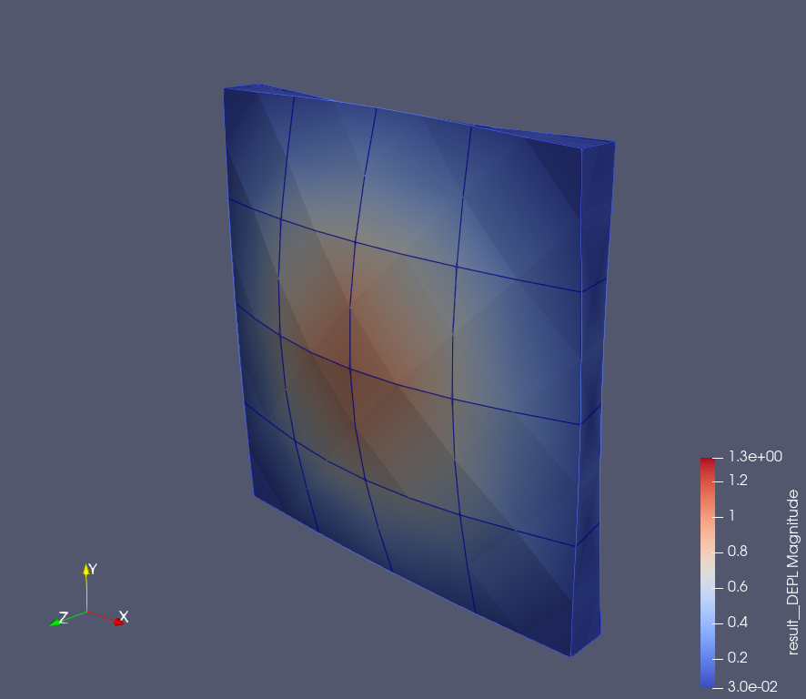

Simply-Supported 'Solid' Square Plate
=====================================

問題の説明
----------

10m×10m×1mのソリッド要素で構成された直方体のモーダル解析のベンチマークです。The Standard NAFEMS BenchmarksにFV52として掲載されています。

条件
----

ベンチマークに使用するメッシュは次の通りです。HOEは2次要素、LOEは1次要素でメッシュのパターンを分けています。

条件図を次に示します。図の左端を並進拘束（XY拘束）し、全節点は奥行方向の並進拘束（Z拘束)しています。

入力する物性値は次の通りです。

.. table:: 入力した材料物性・その他特性

   ========== =============
   材料物性   入力値
   ========== =============
   ヤング率   200E+9 N/m^2
   ポアソン比 0.3
   密度       8000 kg/m^3
   ========== =============

結果と考察
----------

比較する結果は各モード次数での固有振動数の値です。比較結果を示します。

.. table:: Results (Mode4)
   :widths: auto

   ================ ======= ====== ====== ====== ======= ========
   Solver           Pattern Type   Order  Shape  Result  Error
   ================ ======= ====== ====== ====== ======= ========
   Reference value  -       -      1      -      45.897  ‐ 
   Commercial code  HOE     C3D20  2      Hexa   44.796  97.60% 
   Commercial code  LOE     C3D8I  1      Hexa   44.092  96.07%
   Salome-Meca 2021 HOE     3D     2      Hexa   44.796  97.60%
   Salome-Meca 2021 LOE     3D     1      Hexa   51.679  112.60%
   ================ ======= ====== ====== ====== ======= ========

   Commercial code 2nd order elements (mode4)

   Commercial code 1st order elements (mode4)

   Salome-Meca 2019 2nd order elements (mode4)

   Salome-Meca 2019 1st order elements (mode4)

.. table:: Results (Mode5&6)
   :widths: auto

   ================ ======= ====== ====== ====== ======= ========
   Solver           Pattern Type   Order  Shape  Result  Error
   ================ ======= ====== ====== ====== ======= ========
   Reference value  -       -      1      -      109.44  ‐ 
   Commercial code  HOE     C3D20  2      Hexa   110.54  101.01% 
   Commercial code  LOE     C3D8I  1      Hexa   106.66  97.46%
   Salome-Meca 2021 HOE     3D     2      Hexa   110.54  101.01%
   Salome-Meca 2021 LOE     3D     1      Hexa   132.75  121.30%
   ================ ======= ====== ====== ====== ======= ========

   Commercial code 2nd order elements (mode5&6)

.. figure:: simply_supported_solid_square_plate_commercial_LOE_mode5and6.png

   Commercial code 1st order elements (mode5&6)

   Salome-Meca 2019 2nd order elements (mode5&6)

   Salome-Meca 2019 1st order elements (mode5&6)

.. table:: Results (Mode7)
   :widths: auto

   ================ ======= ====== ====== ====== ======= ========
   Solver           Pattern Type   Order  Shape  Result  Error
   ================ ======= ====== ====== ====== ======= ========
   Reference value  -       -      1      -      167.89  ‐ 
   Commercial code  HOE     C3D20  2      Hexa   169.10  100.72% 
   Commercial code  LOE     C3D8I  1      Hexa   156.23  93.05%
   Salome-Meca 2021 HOE     3D     2      Hexa   169.10  100.72%
   Salome-Meca 2021 LOE     3D     1      Hexa   194.38  115.78%
   ================ ======= ====== ====== ====== ======= ========

   Commercial code 2nd order elements (mode7)

   Commercial code 1st order elements (mode7)

   Salome-Meca 2019 2nd order elements (mode7)

   Salome-Meca 2019 1st order elements (mode7)

.. table:: Results (Mode8)
   :widths: auto

   ================ ======= ====== ====== ====== ======= ========
   Solver           Pattern Type   Order  Shape  Result  Error
   ================ ======= ====== ====== ====== ======= ========
   Reference value  -       -      1      -      193.59  ‐ 
   Commercial code  HOE     C3D20  2      Hexa   193.92  100.17% 
   Commercial code  LOE     C3D8I  1      Hexa   193.58  99.99%
   Salome-Meca 2021 HOE     3D     2      Hexa   193.93  100.17%
   Salome-Meca 2021 LOE     3D     1      Hexa   197.19  101.86%
   ================ ======= ====== ====== ====== ======= ========

   Commercial code 2nd order elements (mode8)

   Commercial code 1st order elements (mode8)

   Salome-Meca 2019 2nd order elements (mode8)

   Salome-Meca 2019 1st order elements (mode8)

.. table:: Results (Mode9&10)
   :widths: auto

   ================ ======= ====== ====== ====== ======= ========
   Solver           Pattern Type   Order  Shape  Result  Error
   ================ ======= ====== ====== ====== ======= ========
   Reference value  -       -      1      -      206.19  ‐ 
   Commercial code  HOE     C3D20  2      Hexa   206.64  100.22% 
   Commercial code  LOE     C3D8I  1      Hexa   200.13  97.06%
   Salome-Meca 2021 HOE     3D     2      Hexa   206.64  100.22%
   Salome-Meca 2021 LOE     3D     1      Hexa   210.55  102.11%
   ================ ======= ====== ====== ====== ======= ========

   Commercial code 2nd order elements (mode9&10)

   Commercial code 1st order elements (mode9&10)

   Salome-Meca 2019 2nd order elements (mode9&10)

   Salome-Meca 2019 1st order elements (mode9&10)
